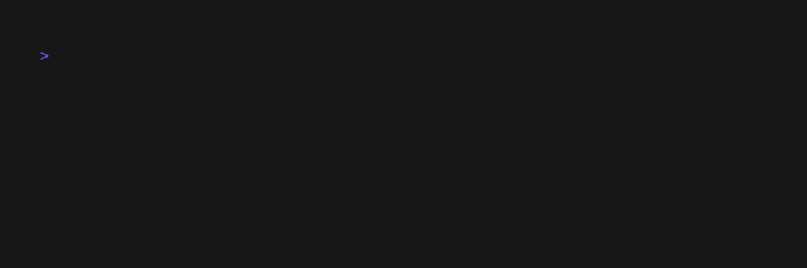

# Random Scale Generator

## About

Randomly generate scale ideas to quickly start a new song. The list of scales are the same used in Ableton Live's Scale Mode.


## Installation
Download the executable from the releases page. Double click to open default mode.

Otherwise in your terminal (in the directory in which the program lives):
```
./scale_generator
```

You can optionally pass the `-b` or `--bpm` flags to additionally generate a random bpm. This setting will live for the duration of your session.


### Build From Source
If you do not already have rust and cargo installed on your machine, first follow the directions as detailed [here](https://doc.rust-lang.org/cargo/getting-started/installation.html).
On the Command Line:

```
git clone https://github.com/benjamingoodheart/scale_gen
cd scale_gen
cargo build --release
```

In /scale_gen directory:
```
./target/release/scale_generator
```
